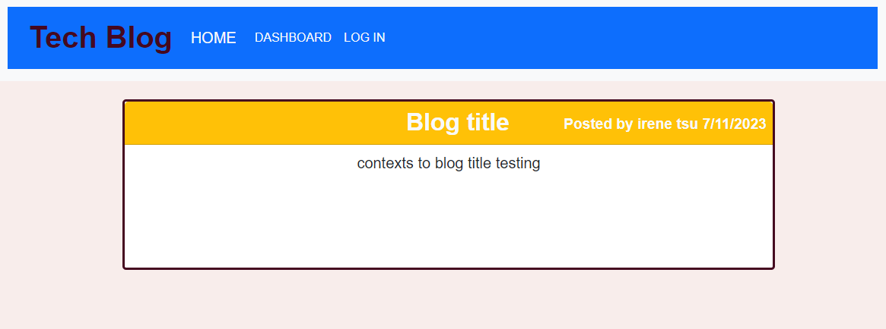

# Tech-Blog

An application that allows the user have an account where they are able to post blogs. The user must create an account and log in to post, update, or delete blogs, however, the homepage with rendered blog posts is open to the public.


## Motivation

There is no question that having the opportunity to view other's thoughts and ideas about tech/programming is super valuable when engaging in this field. With a tech blog, users are able to look at what other techies are up to and also engage with them through commenting on their blog. This is a great way to network and learn at the same time. It is also helpful to write out your own ideas when learning to program. This is a great space to get those ideas out there and retain all the information that is gained.

## Deploy:

## Technologies

Project was created with:
* NODE.JS
* JavaScript
* Express
* Handlebars


## Installation

To run this project, pull it from Github to your local machine using your terminal.
   
#### Steps: 

1. Open Github
2. Navigate to the 'yasminetsu/tech-blog" repository. 
3. Click the green button on the page that says "code."
4. Copy the link under SSH. 
5. Open your terminal and type the following keys.

```
$ cd <any folder you want this repository to go to>
$ git clone <paste the copied link>
```

 


